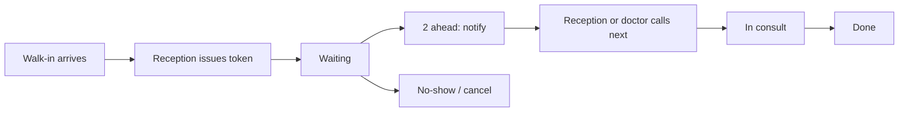
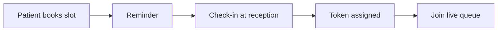

# QueueLite UX flows

Product: small clinic token queue + appointments. Spec: `prompts/clinic-queue-prompt.md`.

## Mixing rule (appointments vs walk-ins)

Appointments occupy a **time window** on the doctor’s calendar. When the patient checks in (or is marked arrived), they receive the **next token number** and are inserted **ahead of unarrived walk-ins that arrived later**, but **behind anyone already called or in consult**.

Walk-ins get a token immediately and wait in arrival order per doctor.

The TV board and patient link show **token numbers only**. Names and phones stay on staff screens.

## Primary flows

## Screen map

| Screen | Actor | Job to be done |
|--------|--------|----------------|
| Login | Staff | Sign in; role lands on the right home |
| Reception today | Reception | Issue token, call next, see names, mix walk-in + appointments |
| Issue token | Reception | Pick doctor, walk-in vs booked, capture name/phone privately |
| Book appointment | Reception / patient later | Slot grid, conflict-free |
| Doctor queue | Doctor | Own list, pause, done, no-show |
| Admin doctors | Admin | Doctors, rooms, avg consult minutes |
| Admin hours | Admin | Hours, SMS flag, notify-when-N |
| Audit | Admin | Issued / called / reordered / cancelled |
| Patient status | Patient | Token + ETA; signed URL; no other patients |
| TV board | Waiting room | Huge numbers, no PII |
| Empty morning | Reception | First token of the day |
| Access denied | Any staff | Wrong clinic / role |
| Invalid link | Patient | Expired or guessed URL |

## Accessibility

- TV: token numbers ≥ 160px, contrast on dark ≥ 7:1
- Staff: 14px+ body, 44px tap targets on primary actions
- Status never by color alone (label + pill)
- Patient page works on a low-end phone; one primary message
